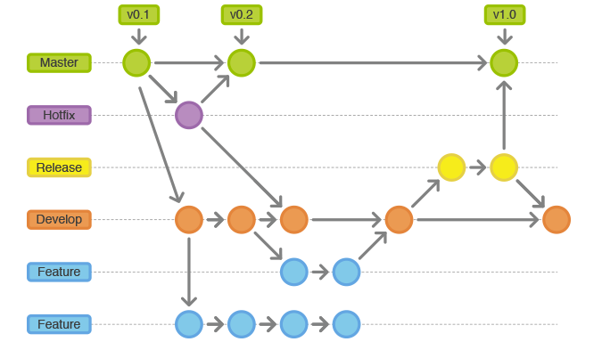

# 开发过程

1. git clone

   - 常用参数 -b

     ```
     git clone -b dev git@github.com:yongPhone/gitskills.git

     remote: Counting objects: 43, done.
     remote: Total 43 (delta 0), reused 0 (delta 0), pack-reused 43
     Receiving objects: 100% (43/43), done.
     Resolving deltas: 100% (12/12), done.
     ```

   - 常用参数 --depth

     ```
     git clone -b dev git@github.com:yongPhone/gitskills.git --depth 1

     Cloning into 'gitskills'...
     remote: Counting objects: 4, done.
     remote: Compressing objects: 100% (3/3), done.
     remote: Total 4 (delta 0), reused 2 (delta 0), pack-reused 0
     Receiving objects: 100% (4/4), done.
     ```

2. 开发及提交过程

   ```
   git checkout dev

   git checkout -b add-comment

   git add --all / git add .

   git commit -m "Add comment xxxxxxxxxxx"

   git checkout dev

   git pull origin dev

   git merge add-comment
   	
   	如果有冲突->解决冲突
   	git add .
   	git commit -m "conflict fixed"
    
   git push origin dev
   ```

3. 分支规范

   

