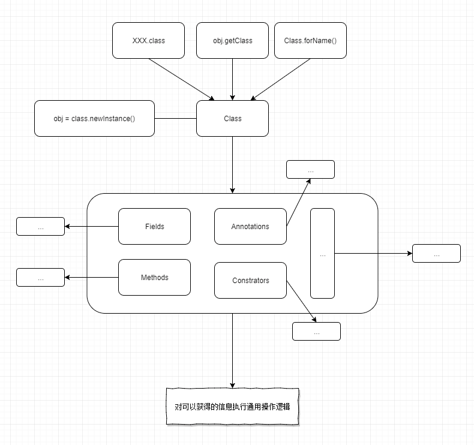

# 反射

## 反射概括



```java
public abstract class BaseProperties {
    public static Properties properties = new Properties();

    static {
        try {
            ClassPathResource resource = new ClassPathResource("topview-utils.properties");
            InputStream inputStream = resource.getInputStream();
            properties.load(inputStream);
            new BondingType();
        } catch (IOException e) {
            e.printStackTrace();
        }
    }

    {
        init();
    }

    public abstract String getPrefix();

    private void init() {
        Class childClass = this.getClass();
        Field[] fields = childClass.getDeclaredFields();
        for (Field field : fields) {
            field.setAccessible(true);
            if (field.getType().equals(String.class)) {
                String fieldName = field.getName();
                String propertiesName = getPrefix() + "." + fieldName;
                String propertiesValue = properties.getProperty(propertiesName);
                if (propertiesValue != null) {
                    try {
                        field.set(this, propertiesValue);
                    } catch (IllegalAccessException e) {
                        e.printStackTrace();
                    }
                }
            }
        }
    }
}
```

> 拓展：unsafe
>
> 赋值:
>
> ```java
> public static void main(String[] args) throws InstantiationException, NoSuchFieldException {
>   	Unsafe unsafe = getUnsafe();
>
>   	class A {
>     	String username;
>     	String password;
>   	}
>   	A a = (A) unsafe.allocateInstance(A.class);
>
>   	long usernameAddress = unsafe.objectFieldOffset(A.class.getDeclaredField("username"));
>   	long passwordAddress = unsafe.objectFieldOffset(A.class.getDeclaredField("password"));
>   	unsafe.getAndSetObject(a, usernameAddress, "username");
>   	unsafe.getAndSetObject(a, passwordAddress, "password");
>   	System.out.println(a);
> }
>
> public static Unsafe getUnsafe() {
>   	try {
>     	Field f = Unsafe.class.getDeclaredField("theUnsafe");
>     	f.setAccessible(true);
>     	return (Unsafe)f.get(null);
>   	} catch (Exception e) {
>     	/* ... */
>   	}
>  	return null;
> ｝
> ```

## 为什么使用反射

便于能够编写动态操纵的java代码，增强程序的灵活性

## 什么时候使用反射

编译期无法进行优化